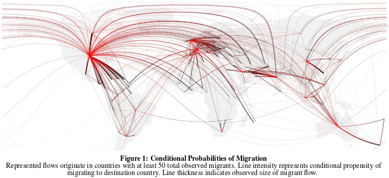
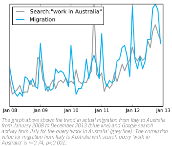
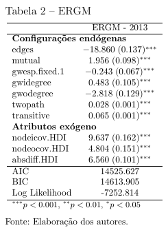
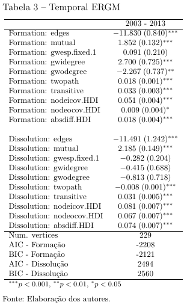

```{r setup, include=FALSE}
library(readr)
library(maps)
library(statnet)
library(igraph)
library(intergraph)
library(dplyr)
library(magrittr)
library(ggplot2)
library(NetworkRiskMeasures)

setwd("~/Documentos/Neylson Crepalde/Doutorado/sea_populacoes/Seminario Big Data/")

#####################################################################################
# ANALISES

paises.latlon = read_csv2("~/Documentos/Neylson Crepalde/Doutorado/sea_populacoes/Seminario Big Data/paises_latlon.csv")
rede.total = read_csv2("~/Documentos/Neylson Crepalde/Doutorado/sea_populacoes/Seminario Big Data/rede_total.csv") 
rede.latlon = read_csv2("~/Documentos/Neylson Crepalde/Doutorado/sea_populacoes/Seminario Big Data/rede_latlon.csv")

paises.latlon %<>% as_data_frame
rede.total %<>% as_data_frame
rede.latlon %<>% as_data_frame

g.ll = graph_from_edgelist(as.matrix(rede.latlon[,1:2]))
weight = rede.latlon$weight
class(weight)
E(g.ll)$weight = weight
g.ll

name = data.frame(V(g.ll)$name, stringsAsFactors = F)
latlon = left_join(name, paises.latlon, by=c("V.g.ll..name"="paises"))
latlon = latlon[-79,]

V(g.ll)$lat = latlon$lat
V(g.ll)$lon = latlon$lon
```


## Os estudos em migrações

A tradição dos estudos em migrações tem trabalhado com dados "oficiais".

> - censos demográficos;
> - surveys;
> - registros administrativos...

---

## Há alguns problemas

Apesar da vantagem de serem confiáveis no que toca à metodologia de coleta, esses dados ficam desatualizados muito rapidamente considerando a sua esparsa periodicidade (quando muito ágeis, são anuais) e a velocidade dos fluxos migratórios.

O **Big Data** parece oferecer soluções interessantes.

--- .segue .dark
## Big Data?

---

"The term "Big Data" usually refers to the vast amount of data generated by the use of digital devices and web-based tools and platforms (Latouzé, 2012). Big Data can also come from other types of digitalsensors and meters, such as satellite imagery."

--- 
## Três V's

>- Volume;
>- Velocidade;
>- Variedade;

---
## Dois tipos de dados

>- fontes com geolocalização, i.e., aplicativos como *Facebook*, *Twitter*, *Flickr*, *Foursquare*, *Instagram*, *Waze*, etc;

>- dados onde o componente local não é o principal, i.e., transações financeiras digitais (e.g, transferências de dinheiro, compras, pagamentos) serviços de comunicação (e.g., padrões anônimos de uso de telefonia celular), serviços de informação (e.g., registros anônimos de buscas online como "mudar para a Austrália", "como conseguir emprego na Alemanha", etc.).

---
## Principais críticas
>- confiabilidade (são menos confiáveis do que as fontes oficiais), 

>- acesso problemático (na maioria das vezes os dados online são propriedade de grandes empresas), 

>- questões éticas (o risco de identificação caso os dados não sejam anonimizados), 

>- viés de seleção (os dados são limitados pelos usuários daquele aplicativo ou site específico) e

>- sua complexidade de análise.

---
## Estudos importantes
> **Zagheni et al (2014)** coletaram *tweets* georreferenciados do Twitter de aprox. 500 mil usuários e, após a seleção de usuários que postavam *tweets* geolocalizados com frequência, investigaram *tweets* de aprox. 3000 usuários. A partir desses dados, os autores puderam identificar pontos de viragem (*turning points*) em tendências migratórias. Além disso, eles encontraram resultados interessantes tanto para migrações internacionais quanto para migrações internas.

> O **Facebook Data Science Team (2013)** utilizou os registros dos usuários mapeando a cidade natal e a cidade atual para verificar migrações internacionais e internas. Dados de todos os usuários que disponibilizaram essa informação foram coletados. Os dados foram analisados de forma agregada e anonimizada.

> **State, Weber & Zagheni (2013)** estudaram a geolocalização dos IP's usados pelos usuários para logar em suas contas de e-mail Yahoo.

---
## State, Weber & Zagheni (2013)




---
## Registros de celulares

> **Sust et al. (2014)** usaram dados de celulares na investigação de movimento turístico. Investigou-se a combinação de dispositivos móveis que usavam um operador Espanhol em Madri e Barcelona e dados de pagamentos eletrônicos de cartões de crédito internacionais.

---
## Ferramentas de Busca
 
> A rede UN Global Pulse (2014) empreendeu um estudo de caso sobre migrações para a Austrália usando dados de pesquisas na ferramenta de busca do Google desagregados por país (e.g., "work visa", "jobs in Melbourne").

> Chaves de busca relevantes foram extraídas do *Google Correlate*, originadas na Austrália de 2008 a 2013 e cruzados com estatísticas oficiais mensais de migrações do *Bureau* de Estatísticas da Austrália. O estudo encontrou uma correlação de 0.74.

--- #mapaUN
## UN Global Pulse (2014)



--- #data
## Data e Métodos

Para os fins deste trabalho, utilizaremos a base de dados *International migration flows to and from selected countries: The 2015 revision* da ONU. Para analisá-los, adotaremos a perspectiva relacional, conhecida como *Social Network Analysis*.

--- bg:black
## <span class="red">Migration Flows</span>
```{r, echo=FALSE, fig.align='center', fig.height=10, fig.width=18}
map("world", col="#191919", fill=TRUE, bg="#000000", lwd=0.08)
#map("world", col="#f2f2f2", fill=TRUE, bg="white", lwd=0.04)
# plot the network using the geo coordinates
plot(g.ll,  # pass in the network
     # don't erase the map before drawing the network
     add=TRUE,
     # don't rescale
     rescale = F,
     # don't show labels
     vertex.label=NA,
     # get coordiantes from vertices and pass in as 2-col matrix
     layout=cbind(V(g.ll)$lon,V(g.ll)$lat),  
     # ---- all the rest of these are optional to make it look nice ------
     # set a semi-transparent edge color
     edge.color=adjustcolor("#5F9EA0", .03),
     #edge.color=adjustcolor('#AA555555', .15),
     edge.width=3,
     # making edges curve
     edge.curved=T,
     # set the vertex size
     vertex.size=10,
     # set arrow size
     edge.arrow.size=1,
     # set a semi transparent vertex color
     vertex.color='white',
     vertex.frame.color='white')
```


---

Essa rede possui uma densidade $\delta = 0.23$ e diâmetro 58. A rede possui $86,23\%$ de laços recíprocos e coeficiente de clusterização $= 0.39$. As distribuições de graus de entrada e saída mostram que trata-se de uma rede livre de escala, ou seja, uma rede complexa. 

Os países com os menores *constraints* são, respectivamente, Estados Unidos, Alemanha, Espanha, Dinamarca, Suécia e Rússia. Esses países desempenham a função de *brokers* nessa rede, ou seja, eles ocupam buracos estruturais, posições importantes na articulação da estrutura. Se, por exemplo, as migrações para esses países fossem, por algum motivo, eliminadas, a estrutura se desarticularia bastante. 

Essa medida nos diz ainda que esses países são os que possuem maior liberdade estrutural, ou seja, são países que tem fluxos migratórios menos redundantes. Isso indica um alto capital social onde a grande autonomia desses países pode ser interpretada como liberdade para tomada de decisões. Isso parece ser um dado importante na medida em que decisões desses países podem tem um impacto grande na estrutura. 

---
## Distribuições de grau de entrada, saída e *constraint*

```{r, echo=FALSE, fig.align='center', fig.height=6, fig.width=14, message=FALSE, warning=FALSE}
indeg = igraph::degree(g.ll, mode = "in")
outdeg = igraph::degree(g.ll, mode="out")
const = constraint(g.ll)

################################
# Multiple plot function
#
# ggplot objects can be passed in ..., or to plotlist (as a list of ggplot objects)
# - cols:   Number of columns in layout
# - layout: A matrix specifying the layout. If present, 'cols' is ignored.
#
# If the layout is something like matrix(c(1,2,3,3), nrow=2, byrow=TRUE),
# then plot 1 will go in the upper left, 2 will go in the upper right, and
# 3 will go all the way across the bottom.
#
multiplot <- function(..., plotlist=NULL, file, cols=1, layout=NULL) {
  library(grid)
  
  # Make a list from the ... arguments and plotlist
  plots <- c(list(...), plotlist)
  
  numPlots = length(plots)
  
  # If layout is NULL, then use 'cols' to determine layout
  if (is.null(layout)) {
    # Make the panel
    # ncol: Number of columns of plots
    # nrow: Number of rows needed, calculated from # of cols
    layout <- matrix(seq(1, cols * ceiling(numPlots/cols)),
                     ncol = cols, nrow = ceiling(numPlots/cols))
  }
  
  if (numPlots==1) {
    print(plots[[1]])
    
  } else {
    # Set up the page
    grid.newpage()
    pushViewport(viewport(layout = grid.layout(nrow(layout), ncol(layout))))
    
    # Make each plot, in the correct location
    for (i in 1:numPlots) {
      # Get the i,j matrix positions of the regions that contain this subplot
      matchidx <- as.data.frame(which(layout == i, arr.ind = TRUE))
      
      print(plots[[i]], vp = viewport(layout.pos.row = matchidx$row,
                                      layout.pos.col = matchidx$col))
    }
  }
}


h1 = ggplot(NULL, aes(indeg))+geom_histogram(fill='#ec7063')+labs(x='Indegree', y='')+theme_bw(base_size = 18)
h2 = ggplot(NULL, aes(outdeg))+geom_histogram(fill='#5dade2')+labs(x='Outdegree', y='')+theme_bw(base_size = 18)
h3 = ggplot(NULL, aes(const))+geom_histogram(fill='#58d68d')+labs(x='Constraint', y='')+theme_bw(base_size = 18)
multiplot(h1,h2,h3, cols = 3)
```

---
```{r, echo=FALSE, results='asis',size=10}
tipos = c("003","012","102","021D","021U","021C","111D","111U","030T","030C",
          "201","120D","120U","120C","210","300")
matriz = cbind(tipos, triad_census(g.ll))
colnames(matriz) <- c("Tipos", "Contagem")
kable(matriz, caption="Censo de tríades")
```

---
## Modelos estatísticos

Modelizamos a emergência da rede de fluxos migratórios em 2013 usando um modelo estatístico específico para dados relacionais, o ERGM (*Exponential Random Graph Model*) ou modelo P\*. Basicamente, esse modelo estima a probabilidade de emergência da rede dadas as suas configurações endógenas (microestruturas) ebem como seus atributos exógenos. 

Modelizamos também a formação e a dissolução de laços usando um modelo derivado do P\*, o TERGM (*Temporal Exponential Random Graph Model*). O TERGM, de maneira resumida, modeliza a probabilidade de formação e dissolução de laços a partir de configurações endógenas (microestruturas) da própria rede e de atributos exógenos. Podemos assim mensurar a emergência dos fluxos migratórios internacionais a partir de suas próprias estruturas e também como sua auto-organização é função de algum atributo específico.

--- &twocol
## Resultados

*** =left


*** =right


---
## Considerações Finais

Em nossa análise, foi possível mostrar que, entre os parâmetros endógenos da própria rede de migrações pelo mundo, a reciprocidade parece ser o elemento mais importante mostrando que os fluxos migratórios de um país A até um país B tem uma forte tendência a obterem retorno. Obviamente, como estamos tratando de dados agregados, não é possível saber se quem sai do país A para B é a mesma pessoa que sai de B e retorna a A ou se são pessoas diferentes migrando em contextos diferentes. Esse problema poderia ser solucionado por dados georreferenciados onde há o controle da mobilidade por cada usuário.
	
Foi possível ainda mostrar que o IDH apresenta-se quase como um condicionante das migrações. Esse fato já é algo conhecido pela literatura embora não tenha recebido o grau de formalização aqui apresentado. A qualidade de vida nos países desenvolvidos e a falta dela nos países subdesenvolvidos tem grande efeito nas migrações. É necessário, entretanto, incorporar outras dados que permitam testar as diversas hipóteses das migrações assim como apresentadas por Massey et al. (1993)

--- .segue bg:black
## <span class="red">Obrigado!</span>

